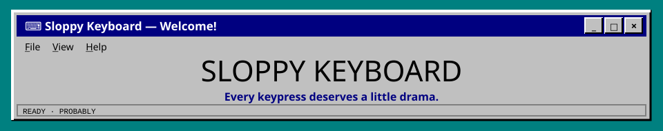
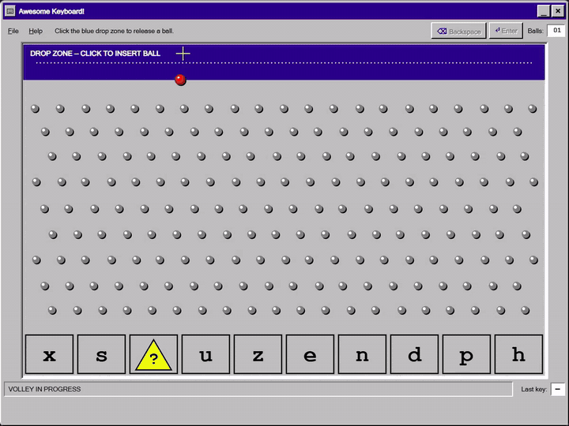
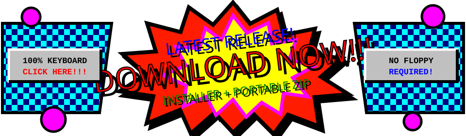
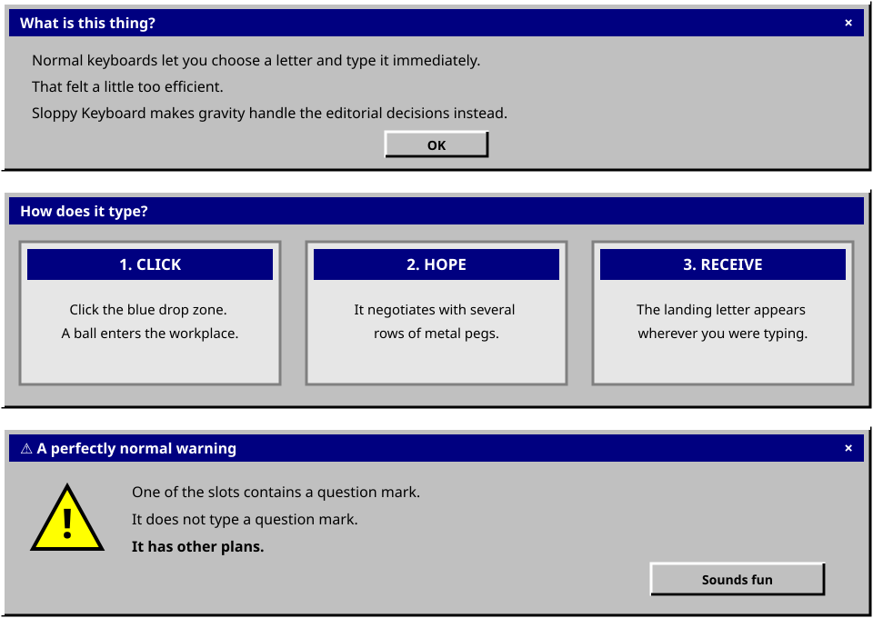
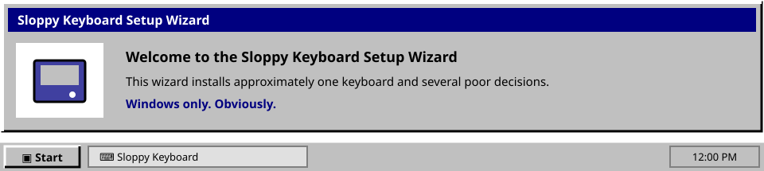

<div align="center">



<br>

<a href="assets/showcase/showcase.mp4">
  
</a>

<br>

<a href="assets/showcase/showcase.mp4"><b>▶ Open the crisp version of showcase.exe</b></a>

<br><br>

<a href="https://github.com/sshcrack/SloppyKeyboard/releases/latest">
  
</a>

<b>★★★★★ “It typed a letter.” — satisfied computer owner</b>

<sub>
FREE OF SUBSCRIPTIONS · FREE OF GOOD JUDGMENT · FULL OF BALLS
<br>
Download now before someone puts this idea behind a paywall.
</sub>

</div>

<br>



Leave a browser, Notepad, a search box, or another innocent text field ready. Sloppy Keyboard stays out of the way while the ball makes the important editorial decisions.

Need more chaos? Drop up to **25 balls at once**. Need Backspace or Enter? Those are premium keystrokes and may require a small display of skill.

No spoilers about the `?` slot. Just know that the computer has been encouraged to improvise.

## Setup



```bash
npm install
npm start
```

<div align="center">
  <sub>It can type. It simply refuses to do so normally.</sub>
</div>
